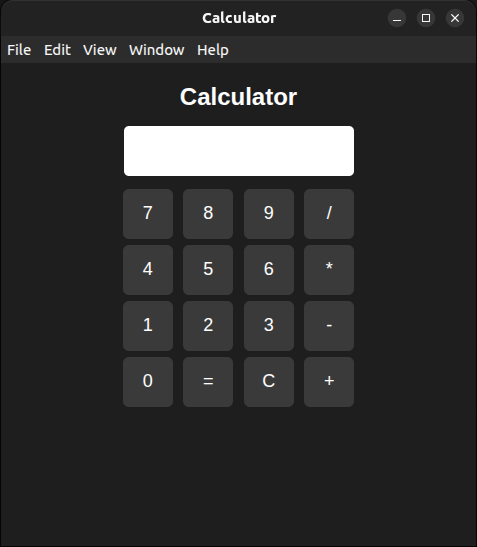

# Electron Calculator App

A simple desktop calculator application built using Electron.js.

## Features

- Simple and clean calculator interface
- Works completely offline
- Built using HTML, CSS, and JavaScript
- Cross-platform desktop application with Electron

## Technologies Used

- Electron.js
- JavaScript
- HTML
- CSS

## Installation

Clone the repository

git clone https://github.com/arathyrajeesh/my-electron-app.git

Go to the project folder

cd my-electron-app

Install dependencies

npm install

Run the application

npm start

## Author

Arathy Rajeesh
